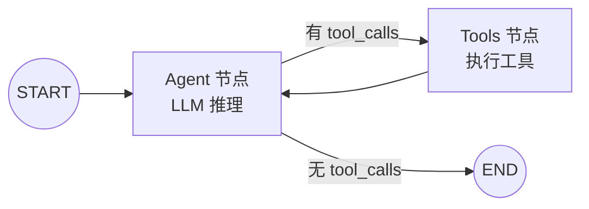

# AI Agent — 学习型 Agent 项目

基于 **LangGraph + LangChain + OpenAI** 构建的 AI Agent，专为学习 Agent 开发而设计。代码结构清晰、注释充分，涵盖业界最核心的 Agent 概念。

## 技术栈

| 组件 | 选型 | 作用 |
|------|------|------|
| 语言 | Python 3.11+ | AI 生态最成熟 |
| Agent 编排 | [LangGraph](https://langchain-ai.github.io/langgraph/) | 状态图驱动的 Agent 控制流 |
| LLM 框架 | [LangChain](https://python.langchain.com/) | 工具绑定、消息抽象 |
| 模型 API | OpenAI 兼容接口 | 支持 GPT / DeepSeek / Ollama 等 |
| CLI | Typer + Rich | 交互式终端体验 |
| HTTP API | FastAPI + Uvicorn | REST 服务 |
| 包管理 | uv / pip | 现代 Python 依赖管理 |

## 核心概念

### 什么是 Agent？

普通 LLM 调用是 **输入 → 输出** 的单次往返。Agent 在此基础上增加了 **自主决策循环**：

```
用户提问 → LLM 推理 → 需要工具? → 执行工具 → 观察结果 → 继续推理 → 最终回答
```

这就是 **ReAct 模式**（Reason + Act），当前业界最主流的 Agent 架构。

### 项目架构

```
src/ai_agent/
├── config.py          # 配置（环境变量）
├── tools/             # 工具定义（Agent 的"手"）
│   └── __init__.py    #   calculator, get_current_time, read_file
├── agent/
│   ├── state.py       # 状态定义（Agent 的"记忆"）
│   ├── nodes.py       # 图节点（Agent 的"大脑"和"手"）
│   └── graph.py       # 状态图编排（Agent 的"神经回路"）
├── main.py            # CLI 入口
└── api/server.py      # FastAPI 服务
```

### 状态图（LangGraph 核心）

Agent 的控制流被建模为有向图：



运行 `ai-agent graph` 可查看实际的 Mermaid 图。

## 快速开始

### 1. 安装依赖

```bash
# 推荐使用 uv（更快）
uv venv && source .venv/bin/activate
uv pip install -e ".[dev]"

# 或使用 pip
python -m venv .venv && source .venv/bin/activate
pip install -e ".[dev]"
```

### 2. 配置 API Key

```bash
cp .env.example .env
# 编辑 .env，填入你的 API Key
```

支持的 Provider 示例：

```bash
# OpenAI
OPENAI_API_KEY=sk-...
OPENAI_BASE_URL=https://api.openai.com/v1
OPENAI_MODEL=gpt-4o-mini

# DeepSeek
OPENAI_API_KEY=sk-...
OPENAI_BASE_URL=https://api.deepseek.com/v1
OPENAI_MODEL=deepseek-chat

# 本地 Ollama
OPENAI_API_KEY=ollama
OPENAI_BASE_URL=http://localhost:11434/v1
OPENAI_MODEL=llama3
```

### 3. 运行

```bash
# 交互式对话
ai-agent chat

# 单次提问
ai-agent ask "现在几点？北京和上海时差多少？"

# 查看可用工具
ai-agent tools

# 查看状态图结构
ai-agent graph

# 启动 HTTP API
ai-agent serve
# 访问 http://localhost:8000/docs 查看 Swagger 文档
```

### 4. 运行测试

```bash
pytest
```

## 学习路径

建议按以下顺序阅读源码，每一层对应 Agent 开发的一个核心概念：

### 第 1 步：理解工具（Tools）

阅读 `src/ai_agent/tools/__init__.py`

- `@tool` 装饰器如何将 Python 函数变成 LLM 可调用的工具
- docstring 如何被自动转为 JSON Schema 供 LLM 理解
- 工具是 Agent 与外部世界交互的唯一方式

**练习**：添加一个 `web_search` 或 `write_file` 工具。

### 第 2 步：理解状态（State）

阅读 `src/ai_agent/agent/state.py`

- `AgentState` 是 Agent 运行时的"记忆"
- `add_messages` reducer 自动合并消息历史
- 消息类型：`HumanMessage`、`AIMessage`、`ToolMessage`、`SystemMessage`

### 第 3 步：理解节点（Nodes）

阅读 `src/ai_agent/agent/nodes.py`

- `agent_node`：调用 LLM，LLM 决定回答还是调工具
- `tools_node`：LangGraph 预置节点，自动执行 tool_calls
- `bind_tools()` 将工具 schema 注入 LLM

### 第 4 步：理解图（Graph）

阅读 `src/ai_agent/agent/graph.py`

- `StateGraph` 定义节点和边
- `_should_continue` 是条件路由：有 tool_calls 就走 tools，否则结束
- `compile()` 生成可执行的 Agent

**练习**：添加 `interrupt_before=["tools"]` 实现 human-in-the-loop（人工审批工具调用）。

### 第 5 步：理解 CLI 与流式输出

阅读 `src/ai_agent/main.py`

- `agent.stream()` 逐步输出每个节点的执行结果
- 适合观察 Agent 的"思考过程"

## 进阶方向

掌握基础后，可以探索这些方向：

| 方向 | 说明 | LangGraph 支持 |
|------|------|----------------|
| **Memory / Checkpoint** | 跨会话持久化对话 | `MemorySaver`, `SqliteSaver` |
| **Multi-Agent** | 多个 Agent 协作 | Subgraph, Supervisor 模式 |
| **Human-in-the-loop** | 人工审批关键操作 | `interrupt_before` |
| **RAG** | 检索增强生成 | 添加 vector store 工具 |
| **MCP 集成** | 连接外部 MCP 服务 | `langchain-mcp-adapters` |
| **可观测性** | 追踪 Agent 执行 | LangSmith |

## API 示例

```bash
# 健康检查
curl http://localhost:8000/health

# 对话
curl -X POST http://localhost:8000/chat \
  -H "Content-Type: application/json" \
  -d '{"message": "计算 (100 - 32) * 5/9 的结果"}'
```

## 项目结构总览

```
ai-agent/
├── pyproject.toml          # 项目配置与依赖
├── .env.example            # 环境变量模板
├── README.md               # 本文档
├── src/ai_agent/           # 源代码
│   ├── config.py
│   ├── main.py
│   ├── tools/
│   └── agent/
├── tests/                  # 单元测试
└── LICENSE
```

## License

MIT
